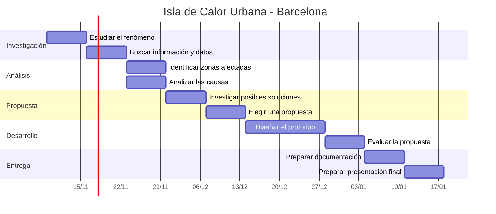

# Diagrama de Gantt – Isla de Calor Urbana en Barcelona

Este calendario recoge las principales tareas previstas para desarrollar el proyecto.

```mermaid
gantt
    title Isla de Calor Urbana - Barcelona
    dateFormat YYYY-MM-DD
    axisFormat %d/%m

    section Investigación
    Estudiar el fenómeno :a1, 2026-11-09, 7d
    Buscar información y datos :a2, 2026-11-16, 7d

    section Análisis
    Identificar zonas afectadas :a3, 2026-11-23, 7d
    Analizar las causas :a4, 2026-11-23, 7d

    section Propuesta
    Investigar posibles soluciones :a5, 2026-11-30, 7d
    Elegir una propuesta :a6, 2026-12-07, 7d

    section Desarrollo
    Diseñar el prototipo :a7, 2026-12-14, 14d
    Evaluar la propuesta :a8, 2026-12-28, 7d

    section Entrega
    Preparar documentación :a9, 2027-01-04, 7d
    Preparar presentación final :a10, 2027-01-11, 7d
```

